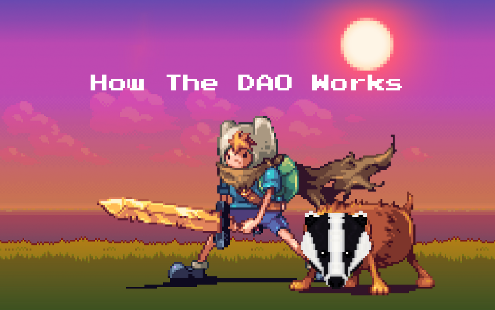
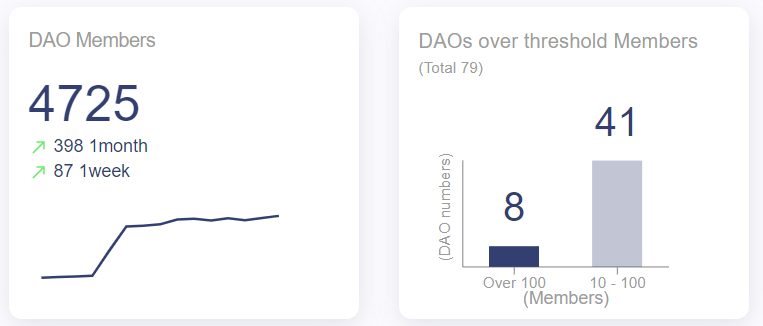
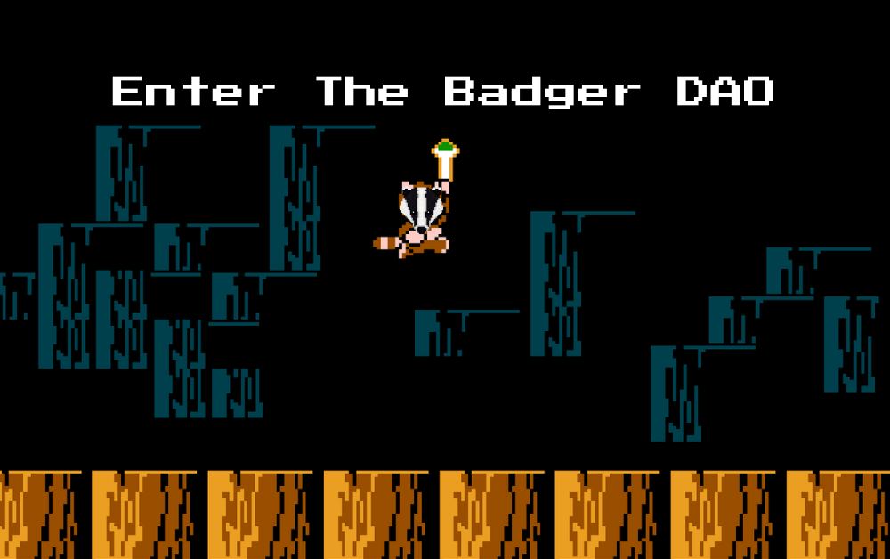

# Badger DAO: Πως Λειτουργεί

Η αγορά των DAO έχει επιταχύνει περισσότερο από ποτέ το 2020, με εταιρείες που σχηματίζουν DAOs για να παρακολουθούν την τάση της κοινοτικής διακυβέρνησης των προϊόντων τους. Είναι αυτό που κάνουν οι εταιρείες DeFi για να παραμείνουν "μοντέρνες" και να καβαλήσουν την αφήγηση αποκέντρωσης που τείνει να κάνει την κοινότητα Ethereum να τους τρέχουν τα σάλια. Τα tokens διακυβέρνησης γίνονται το νέο "utility token" από το 2017, με περιορισμένη λειτουργικότητα και ακόμη λιγότερη διατήρηση χρηστών. Συνολικά, η τρέχουσα πτωτική συμπεριφορά της αγοράς τον Σεπτέμβριο του 2020 διαχωρίζει τις πραγματικές πρωτοβουλίες από τα pump-and-dumps, κάτι που είναι υγιές για τη βιομηχανία. Αυτό επιτρέπει λιγότερο θόρυβο να φιλτράρεται όταν εμφανιστεί ένα έγκυρο έργο με γνήσιες προσπάθειες ενίσχυσης της κοινότητας.

Η πραγματικότητα είναι ότι τα DAO έχουν ΠΟΛΥ μικρή συμμετοχή στην κοινοτική διακυβέρνηση στην τρέχουσα μορφή τους. Αυτό μπορεί να οφείλεται σε πολύ λίγους λόγους, όπως το υψηλό τέλος gas στο Ethereum για ψηφοφορία επί της αλυσίδας, αλλά ο πιο εκθαμβωτικός λόγος είναι ότι δεν έχουν την αίσθηση της κοινής ιδιοκτησίας. Μπορούν να ψηφίσουν, αλλά εάν το άτομο ή η ομάδα ατόμων (ρυθμίσεις multi-sig) δεν θέλουν να κάνουν την αλλαγή, τότε η εγκεκριμένη ψήφος δεν έχει σημασία. Αυτό είναι ένα μεγάλο πρόβλημα.

Ο τύπος DAO που έχει δει τη μεγαλύτερη δραστηριότητα μεταξύ των μελών του είναι τα επιχειρηματικά DAO. Γιατί; Έχουν συμφέροντα και είναι υπεύθυνοι για κάθε τμήμα της επιχείρησης, συμπεριλαμβανομένων της επιμέλειας, της προμήθειας, των εγκρίσεων, των επενδύσεων κ.λπ. Η [Metacartel Ventures](https://metacartel.xyz/) είναι ένα τέλειο παράδειγμα αυτού και ηγείται της επέλασης όσον αφορά την συμμετοχή στην διακυβέρνηση. Τα DAO που εστιάζουν στο προϊόν πρέπει να ακολουθήσουν αυτά τα βήματα και να διασφαλίσουν ότι τα μέλη της κοινότητας συμμετέχουν σε κάθε στάδιο ανάπτυξης προϊόντων, ενώ μοιράζονται την αξία που δημιουργείται μέσω αυτών των προϊόντων.

Το Badger DAO δεν είναι "DAO για χάρη του DAO". Επικεντρώνεται στη δημιουργία ενός περιβάλλοντος για τους δημιουργούς ώστε να συνεργάζονται αντί να ανταγωνίζονται, με μια κοινή αποστολή, να φέρουν το BTC στο DeFi. Δεν υπάρχει νομική εταιρεία, είναι κοινότητα.

Όλα τα προϊόντα είναι σχεδιασμένα και κυκλοφορούν από μέλη της κοινότητας με την υποστήριξη της ομάδας επιχειρήσεων του Badger και του ταμείου του DAO. Η πραγματική κοινή ιδιοκτησία βρίσκεται στην πρώτη γραμμή με οποιαδήποτε αξία που δημιουργείται από αυτά τα προϊόντα να διανέμεται μεταξύ του DAO, κατόχων Badger tokens και όσων εμπλέκονται στη δημιουργία του προϊόντος. Πιστεύουμε ότι αυτό θα οδηγήσει σε μια πολύ πιο εμπλεκόμενη κοινοτική διακυβέρνηση.

## Ορισμός Διοίκησης του Βadger

Το Badger DAO έχει δημιουργήσει ένα [Aragon DAO](https://aragon.org/), όπου οικονομικές και οργανωτικές αποφάσεις μπορούν να ληφθούν μέσω συναίνεσης και έξυπνων συμβολαίων. Οι παράμετροι για την διαδικασία προτάσεων θα απαιτούν το 10% της συνολικής προσφοράς της συμμετοχής του token διακυβέρνησης του Badger, όπου 50% απαρτία απαιτείται μετά από 7 ημέρες για να περάσει μια ψηφοφορία. Οι περισσότερες από τις αποφάσεις που σχετίζονται με το πρωτόκολλο και τη χρηματοδότηση θα εκτελεστούν με αυτόν τον τρόπο. Το Badger token θα επηρεάσει όλα τα προϊόντα και τα πρωτόκολλα του Badger DAO. Όπως για παράδειγμα με το πρώτο μας προϊόν το [Digg](http://www.badger.finance/digg), ένα νόμισμα ελαστικής προμήθειας που συνδέεται με το Bitcoin, οι κάτοχοι Badger tokens θα διέπουν όλες τις αποφάσεις μάρκετινγκ, τις παραμέτρους πρωτοκόλλου, την προμήθεια των tokens και τυχόν μελλοντικές αλλαγές έξυπνων συμβολαίων, και αυτό θα ισχύει για τα επόμενα έργα που θα δημιουργηθούν από το DAO. Η ψηφοφορία εκτός αλυσίδας (Snapshot, Discord, Telegram κ.λπ.) θα πραγματοποιηθεί για περισσότερα ζητήματα που σχετίζονται με προϊόντα και λειτουργίες.

## Σχετικά με τη Διαχείριση του Ταμείου

Βάζουμε ένα μεγάλο στοίχημα ότι η κοινότητα που θα αναπτύξουμε θα είναι σε θέση να αποφασίσει το πού θα διατεθούν τα κεφάλαια του DAO. Δεν θα χρειαστεί γράφημα πίτας. Πριν από την κυκλοφορία δεν πιστεύαμε ότι ήταν στην διακριτική ευχέρεια των ομάδων λειτουργίας να καθορίσουν το πώς θα χρησιμοποιείται η υπόλοιπη προμήθεια, γι 'αυτό δίνουμε αυτόν τον έλεγχο στην κοινότητα κατά την κυκλοφορία. Το 35% της προσφοράς των τokens θα κρατηθεί απο το ίδιο το Badger DAO. Τα κεφάλαια θα μπορούσαν να αποδεσμευτούν για διάφορους σκοπούς, όπως λειτουργίες, πρόσθετα γεγονότα εξόρυξης ρευστότητας, κίνητρα συνεργασίας (π.χ. διανομή Badger ως μέρος της συμμετοχής συνεργατών), κίνητρα υιοθέτησης προϊόντων κ.λπ. Αυτά θα περάσουν μόνο μετά από εγκεκριμένες κοινοτικές ψήφους. Μια άλλη πιθανότητα θα μπορούσε να είναι επιχορηγήσεις που προωθούν το οικοσύστημα DeFi, όπως το Gitcoin και επιχορηγήσεις σε προγραμματιστές του Bitcoin Core. Είναι ο λόγος για τον οποίο το Bitcoin είναι αυτό που είναι σήμερα ούτως ή άλλως.

1. Τα μέλη της κοινότητας προτείνουν νέες ιδέες προϊόντων για σχόλια και συνεργασία στο Discord του Badger DAO ή/και στο φόρουμ.

2. Μόλις τα σήματα υποδηλώσουν ότι το ενδιαφέρον της κοινότητας και οι ιδέες αναπτυχθούν περαιτέρω, θα υπάρξει μια ψήφος εκτός αλυσίδας για να προσδιοριστεί εάν θα πρέπει να προωθηθεί μέσω ζωντανής ροής στην ευρύτερη κοινότητα.

3. Στη συνέχεια θα μετατραπεί σε καθορισμένο πεδίο εφαρμογής, συμπεριλαμβανομένων των απαιτήσεων του προϋπολογισμού, των αναγκών πόρων κ.λπ.

4. Μετά την έγκριση, η ομάδα επιχειρήσεων του Badger DAO θα δεσμευτεί να συνεργαστεί στενά με μέλη της κοινότητας που ηγούνται του προϊόντος και θα συνεργαστεί μαζί τους για την κυκλοφορία.

5. Το ταμείο του Badger DAO θα υποστηρίξει τις απαιτήσεις χρηματοδότησης και το προϊόν μπορεί να αξιοποιήσει τα περιουσιακά στοιχεία του DAO, όπως τα Badger tokens, σε νέους χρήστες με κίνητρο μετά την κυκλοφορία.

6. Οι δημιουργοί προϊόντων, οι κάτοχοι Badger tokens και το DAO θα μοιράζονται όλοι την αξία που δημιουργείται μέσω του προϊόντος, όπως τέλη ή έσοδα.

Ένα σημαντικό πράγμα που πρέπει να σημειωθεί είναι ότι, βάσει του οποίου τα μέλη της κοινότητας προτείνουν αυτές τις ιδέες, δεν θα είναι πάντα τόσο ξεκάθαρη διαδικασία όσο περιγράφεται παραπάνω. Ένα παράδειγμα είναι εάν ένα έργο DeFi με δικό του κεφάλαιο και ανθρώπινους πόρους θέλει να κατασκευάσει ένα προϊόν με το Badger DAO. Στο πλαίσιο της πρότασής τους μπορούν να αναλύσουν την προθυμία τους να διαθέσουν αυτούς τους πόρους και μαζί με την ομάδα επιχειρήσεων και άλλα μέλη της κοινότητας, το προϊόν μπορεί να ζωντανέψει.

## Τι Ορίζει Έναν Badger Builder;

Με όλα τα πράγματα και σε όλα τα πράγματα, είμαστε συγγενείς.

Οι κατασκευαστές του Badger είναι η ραχοκοκαλιά ολόκληρου του DAO. Είναι μέλη της κοινότητας που έχουν δεσμευτεί να συνεργάζονται για να φέρουν νέα προϊόντα στη ζωή. Ένας **Κατασκευαστής του Badger** θα μπορούσε να είναι προγραμματιστής, μια ομάδα προγραμματιστών, μια εταιρεία ή απλά ένα παθιασμένο μέλος της κοινότητας που θέλει να υποστηρίξει και να διαδώσει την γνώση για τα προϊόντα και την αποστολή του Badger DAO. Δεν απαιτούνται υποχρεώσεις στο επίπεδο συμμετοχής που απαιτείται. Είναι ένας κυλιόμενος φορέας διακυβέρνησης, οι πόρτες είναι ανοιχτές για οποιονδήποτε να μπει και να λερώσουν τα χέρια τους. Τα προϊόντα θα σχεδιαστούν και θα επικυρωθούν για ανάπτυξη από την κοινότητα, μαζί με τους ανθρώπους που χρηματοδοτούνται για την κατασκευή τους. Το Badger DAO θα είναι ένα ποικίλο οικοσύστημα παροχών ρευστότητας, προγραμματιστών, δημιουργών περιεχομένου, καλλιτεχνών meme και χρηστών που συμμετέχουν σε μια πληθώρα νέων χρηματοοικονομικών μέσων. Η ποικιλία αυτής της συλλογικότητας θα λειτουργήσει μόνο προς όφελος όλων. Τα μέλη του Badger DAO έχουν μερίδιο στην επιτυχία του DAO - που σημαίνει ότι τα έσοδα των προϊόντων δεν θα εγκαταλείψουν το σύστημά μας. Τα κέρδη πρέπει να πηγαίνουν σε όλους εκείνους που συνέβαλαν στην ανάπτυξή τους.

## Υιοθέτηση Χρηστών

Εξίσου σημαντικό με τους κατασκευαστές του Badger DAO είναι οι κήρυκες· οι υποστηρικτές των νέων προϊόντων που αναπτύσσονται από το Badger DAO. Αυτά τα άτομα θα είναι υπεύθυνα του γραπτού και παραγόμενου περιεχομένου, από την τέχνη, τις εκδόσεις, τη δημιουργία meme και τα βίντεο. Φυσικά θα έχουν τη βοήθεια του ταμείου του Badger DAO για να χρηματοδοτήσουν τέτοια υλικά. Το Badger DAO θα υποστηρίξει επίσης εκστρατείες διανομής ανταμοιβών, όπου είναι στρατηγικά εφαρμόσιμο, για να προωθήσει την υιοθέτηση αυτών των προϊόντων και να εμπνεύσει τη διατήρηση των χρηστών. Όλες οι πιθανές υπηρεσίες κοινής ωφέλειας βρίσκονται στο τραπέζι για συζήτηση. Ορίζουμε ότι χτίζουμε και σχεδιάζουμε τις μεθοδολογίες μας. Οι νεοεισερχόμενοι στην κοινότητά μας θα πρέπει να υποδεχτούν με εφαρμόσιμους τρόπους για να αποκτήσουν το token διακυβέρνησης μας και να τους καλωσορίσουμε στο Badger DAO.

---

Στόχος μας είναι να καινοτομήσουμε τον τρόπο λειτουργίας των DAO και στη συνέχεια να δημιουργήσουμε ένα αίσθημα κοινής ιδιοκτησίας στην κοινότητα. Με αυτό, έχουμε μια πιο αφοσιωμένη δραστηριότητα διακυβέρνησης και δημιουργούμε καλύτερα προϊόντα. Όσο σημαντικές είναι οι λειτουργίες του DAO, άλλο τόσο σημαντική είναι η προέλευση του. Πρέπει να επιδείξει δικαιοσύνη, ένταξη και διαφάνεια. Με την προσπάθειά μας να έχουμε όσο το δυνατόν πιο δίκαιη κυκλοφορία, ελπίζουμε ότι η κοινότητα θα μπορεί να δει σε τι πιστεύουμε και τι μπορούμε να γίνουμε μαζί.

Οι ασβοί είναι άγρια ζώα που είναι πρόθυμα να προστατεύσουν τον εαυτό τους και τους αγαπημένους τους με κάθε κόστος, ακόμη και από μεγαλύτερα ζώα. Θέλουμε το Badger DAO να έχει το ίδιο επίπεδο ενότητας και μια έντονη επιθυμία να δημιουργεί.

**Ακολουθήστε**:

- ℹ️ **[Επισκεφτείτε τον Ιστότοπο μας](http://www.badger.finance/)**
- ➡️ **[Δείτε το Github μας](https://github.com/Badger-Finance)**
- ➡️ **[Εγγραφείτε στο Discord](https://discord.gg/xSPFHHS)**
- ➡️ **[Ακολουθήστε μας στο Twitter](http://twitter.com/badgerdao)**
- ➡️ **[Συνδεθείτε στο Telegram](https://t.me/badger_dao)**

**Αυτό το άρθρο προορίζεται μόνο για ενημερωτικούς σκοπούς. Ζητήστε ανεξάρτητες νομικές και οικονομικές συμβουλές στη δικαιοδοσία σας προτού λάβετε επενδυτικές αποφάσεις.**

---

**Πρωτότυπο Άρθρο (Αγγλική)**: [Badger DAO: How It Works](https://badgerdao.medium.com/badger-dao-how-it-works-57854b31f264)

**Συντάκτης Πρωτότυπου Άρθρου**: [Badger DAO](https://badgerdao.medium.com/)

**Ημερομηνία Συγγραφής Πρωτότυπου Άρθρου**: 23 Σεπτεμβρίου 2020

**Μεταφραστές**: [Donald A. Iljazi](https://twitter.com/oeadgk01), [Iason Andreou](https://twitter.com/jasonrises)

**Ημερομηνία Μετάφρασης**: 11 Δεκεμβρίου 2020
