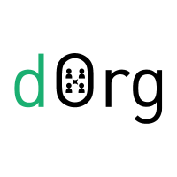

# Παρουσίαση του Badger DAO

Για πολλούς από εμάς ήταν μια μεγάλη πτωτική αγορά 2.5 ετών, ειδικά για τους νέους στον χώρο. Εκείνοι που επικεντρώθηκαν στην ανάπτυξη κατά τη διάρκεια αυτής της περιόδου αρχίζουν να βλέπουν τους καρπούς της εργασίας τους. Πολλά από τα πράγματα που όλοι πιστεύαμε ότι θα είναι στο προσκήνιο είναι τώρα αυτά για τα οποία είναι όλοι ενθουσιασμένοι και η αποκεντρωμένη οικονομία (DeFi) είναι στην κορυφή αυτής της λίστας.

Η συνολική αξία που είναι κλειδωμένη στα πρωτόκολλα αποκεντρωμένης οικονομίας (DeFi) αυξήθηκε από περίπου 650 εκατομμύρια δολάρια την 1η Ιανουαρίου 2020 σε 8.5 δισεκατομμύρια δολάρια σήμερα. Αποκεντρωμένες εφαρμογές (dApps) όπως το [Uniswap](https://uniswap.org/) είναι πλέον κυρίαρχοι παίκτες που συχνά επισκιάζουν μεγάλα κεντροποιημένα συναλλακτήρια σε ημερήσιο όγκο. Φορείς συγκέντρωσης όπως το [YFI](http://yearn.finance/) έχουν εκτοξευτεί στον χώρο όπως και άλλα κορυφαία πρωτόκολλα δανεισμού όπως το [Compound](https://compound.finance/), το [Synthetix](https://www.synthetix.io/) και το [Aave](https://aave.com/) έχουν αναπτύξει εξαιρετικά δοκιμασμένα πρωτόκολλα για πάνω από 2 χρόνια τα οποία διαχειρίζονται δισεκατομμύρια δολάρια. Μπορούμε να πούμε ότι η αποκεντρωμένη οικονομία (DeFi) ήρθε για να μείνει.

Δυστυχώς όμως θα υπάρξουν και προσπάθειες για "αρπαχτές". Νέα νομίσματα με ονόματα φαγητών και με ανώνυμους ιδρυτές όπως τα pasta, noodle, hotdog, kimchi κλπ., κυκλοφορούν μη ελεγμένος κώδικες αντιγραμμένους από άλλα δημοφιλή πρωτόκολλα αποκεντρωμένης οικονομίας (DeFi) και συγκεντρώνουν εκατοντάδες εκατομμύρια δολάρια σε διάστημα ωρών. Αυτές οι αποκεντρωμένες εφαρμογές (dApps) ως επί το πλείστον δεν έχουν εγγενή αξία ή σκοπό και αναπόφευκτα θα χαθούν στην αφάνεια.

Όμως πάντα έρχονται μερικά καλά μαζί με τα άσχημα. Αποκεντρωμένες εφαρμογές (dApps) όπως το Yearn.finance έχουν πυροδοτήσει μια μετάβαση από αποκεντρωμένες εφαρμογές (dApps) με κεντρικό έλεγχο χρηματοδοτούμενες από επενδυτές ή από επενδυτικές εταιρίες σε μια "δίκαιη κυκλοφορία token" με την κοινότητα να έχει τον έλεγχο της από την αρχή.

Άλλη μια σημαντική πρόοδος του τελευταίου έτους ήταν η ζήτηση για την χρήση του Bitcoin ως εγγύηση σε άλλα blockchain, ειδικά στο Ethereum.

> Την 1η Ιανουαρίου 2020 υπήρχαν 1000 Bitcoin στο Ethereum. Σήμερα υπάρχουν πάνω από 56,000.

**Πηγή*: [BTC on Ethereum[(https://btconethereum.com/)

Το Bitcoin είναι το πιο αξιόπιστο χρήμα που εφευρέθηκε ποτέ. Πολλοί θα υποστήριζαν ότι παρέχει την υψηλότερη ασφάλεια που έχουμε δει έως τώρα. Σήμερα υπάρχουν περιορισμένοι τρόποι χρήσης του BTC για αποκεντρωμένη οικονομία (DeFi), ειδικά στο δίκτυο του Bitcoin. Για αυτόν τον λόγο ένας αυξανόμενος αριθμός κατόχων Bitcoin ενσωματώνουν BTC στο Ethereum για να χρησιμοποιήσουν οικονομικά πρωτόκολλα όπου θα παίρνουν τόκο, δανειοληψία έναντι της θέσης τους στην αγορά κλπ.

Το πρόβλημα είναι ότι η υποδομή, τα προϊόντα και τα πρωτόκολλα για την χρήση του BTC σε άλλα blockchain είναι σε αρχικά στάδια. Οι περισσότερες γέφυρες BTC έχουν κεντροποιημένα μέρη τα οποία πρέπει να εμπιστευτούμε για τη κράτηση και δημιουργία του αντίστοιχου BTC στο ETH. Υπάρχουν μόνο δύο μεγάλα κοινά ταμεία ρευστότητας για συναλλαγή συνθετικών BTC. Αν και πολλά από τα πρωτόκολλα δανεισμού έχουν ενεργοποιήσει αυτά τα ενσωματωμένα περιουσιακά στοιχεία ως εγγύηση, υπάρχουν μόνο μερικά από αυτά στην αγορά αυτή τη στιγμή.

Με την ωριμότητα της υποδομής έξυπνων συμβολαίων, την άνοδο της αποκεντρωμένης οικονομίας (DeFi), τη ζήτηση για δίκαιες κυκλοφορίες, τις δυνατότητες του BTC στην αποκεντρωμένη οικονομία (DeFi) και την επιθυμία της κοινοτικής ιδιοκτησίας των προϊόντων, αποφασίσαμε να δημιουργήσουμε το **Badger DAO**.

## Τι Είναι το Badger DAO

Το [Badger](http://www.badger.finance/) είναι ένας αποκεντρωμένος αυτόνομος οργανισμός (DAO) με έναν και μόνο σκοπό: να δημιουργήσει τα προϊόντα και την υποδομή που απαιτούνται για την επιτάχυνση της ενσωμάτωσης του Bitcoin ως εγγύηση σε άλλα blockchain.

Ο σκοπός του είναι ένα οικοσύστημα ενός αποκεντρωμένου αυτόνομου οργανισμού (DAO) όπου αποκεντρωμένες εφαρμογές (dApps) και άτομα από όλη την αποκεντρωμένη οικονομία (DeFi) μπορούν να μαζευτούν ώστε να συνεργαστούν και να δημιουργήσουν τα προϊόντα που χρειάζεται ο χώρος μας. Η κοινή ιδιοκτησία στον αποκεντρωμένο αυτόνομο οργανισμό (DAO) θα επιτρέψει στους προγραμματιστές να έχουν κοινά κίνητρα, ενώ η αποκεντρωμένη διακυβέρνηση μπορεί να διασφαλίσει ότι αυτά τα κίνητρα θα παραμείνουν δίκαια για όλα τα μέρη. Η ιδέα είναι λιγότερος ανταγωνισμός και περισσότερη συνεργασία.

Για αυτόν τον λόγο είναι σημαντικό να ξεκινήσει ως κοινοτική πρωτοβουλία από την αρχή με όλα τα ιδιωτικά κλειδιά έξυπνων συμβολαίων, τα περιουσιακά στοιχεία και τα προϊόντα να βρίσκονται στον έλεγχο των κατόχων $BADGER tokens. Όλες οι αποφάσεις λαμβάνονται μέσω διακυβερνητικής ψηφοφορίας συμπεριλαμβανομένου του τι, πώς και πότε δημιουργούνται τα προϊόντα του Badger DAO. Εξίσου σημαντικό είναι να διασφαλιστεί η δίκαιη κατανομή του $BADGER token για να δώσει σε όλους τους συμμετέχοντες την ευκαιρία να πάρουν μέρος και να επωφεληθούν.

Έτσι δημιουργούνται τα θεμέλια που διασφαλίζουν ότι το Badger θα παραμένει πάντα κοινοτικό, δίκαιο και διαφανές.

1. Προγραμματιστές
2. Προϊόντα που δημιουργήθηκαν από την κοινότητα
3. Αφοσιωμένη ομάδα διαχείρισης
4. Δίκαια αρχική κατανομή των $BADGER tokens για διακυβέρνηση
5. Ανοιχτός κώδικας
6. Αποκεντροποιημένος έλεγχος

Τα μέλη της κοινότητας του Badger μπορούν να προτείνουν νέες ιδέες για προϊόντα στο DAO, να προωθήσουν την πρόταση στην ευρύτερη κοινότητα μέσω βίντεο, και τελικά να υποβάλουν την πρόταση σε μια επίσημη ψηφοφορία προς έγκριση εφόσον περάσει αυτά τα στάδια. Εφόσον εγκριθεί, η ομάδα διαχείρισης του Badger DAO θα συνεργαστεί μαζί τους για την ανάπτυξη, την χρηματοδότηση και την προώθηση στην αγορά. Φυσικά η πρόθεση είναι οι προτάσεις να δημιουργούνται από πολλά μέλη της κοινότητας ώστε να δημιουργήσουν τα καλύτερα πιθανά προϊόντα.

Οι προγραμματιστές του Badger είναι ανοιχτοί και πρόθυμοι να συνεργαστούν με οποιονδήποτε θέλει να δημιουργήσει κάτι μαζί μας. Θα ήταν εκπληκτικό να βλέπαμε κορυφαίους προγραμματιστές και πρωτόκολλα αποκεντρωμένης οικονομίας (DeFi) να συμμετέχουν σε αυτό το πρόγραμμα.

Αυτή η δομή έχει ως στόχο να δώσει σε όλους την ευκαιρία να δημιουργήσουν ότι χρειάζεται, ανεξάρτητα από το αν είναι ένας ανεξάρτητος προγραμματιστής, εταιρία blockchain, εξωτερικοί συνεργάτες ή απλά ένα άτομο με μια ιδέα. Οτιδήποτε δημιουργείται από την κοινότητα Badger θα πρέπει να είναι εγγενώς δίκαιο, διαφανές και να επιβραβεύει όλους όσους εργάστηκαν πάνω σε αυτό. Αυτό περιλαμβάνει κοινόχρηστη προμήθεια, αμοιβές σε tokens κλπ.

Πιστεύουμε ότι από κοινού η κοινότητα μπορεί να κατασκευάσει πιο αποτελεσματικά τα προϊόντα που η βιομηχανία μας χρειάζεται, σε σύγκριση με κεντροποιημένες οντότητες που δημιουργούν μη ολοκληρωμένες λύσεις.

## Πώς θα Κυκλοφορήσει το Badger Token

**ΑΠΟΠΟΙΗΣΗ ΕΘΥΝΩΝ: ΤΟ BADGER ΕΙΝΑΙ ΑΠΟΚΛΕΙΣΤΙΚΑ ΕΝΑ TOKEN ΓΙΑ ΤΗΝ ΔΙΑΚΥΒΕΡΝΗΣΗ ΤΟΥ ΑΠΟΚΕΝΤΡΩΜΕΝΟΥ ΑΥΤΟΝΟΜΟΥ ΟΡΓΑΝΙΣΜΟΥ (DAO) ΚΑΙ ΤΙΣ ΔΡΑΣΤΗΡΙΟΤΗΤΕΣ ΤΟΥ. ΔΕΝ ΕΧΕΙ ΚΑΜΙΑ ΝΟΜΙΣΜΑΤΙΚΗ ΑΞΙΑ.**

Το Badger θα ακολουθήσει τα βήματα του YFI με μια δίκαιη εκκίνηση εξόρυξης ρευστότητας (Liquidity Mining). Προσπαθούμε να καινοτομήσουμε τον τρόπο διεξαγωγής μιας δίκαιας κυκλοφορίας.

- Μηδενικός ατομικός ή κεντρικός έλεγχος των έξυπνων συμβολαίων κατά την κυκλοφορία.
- Σταθερός αριθμός tokens με την συνάρτηση mint να καίγεται κατά την εκκίνηση.
- Όλα τα έξυπνα συμβόλαια και τα συστήματα θα έχουν ελεγχθεί πριν από την κυκλοφορία.
- Προκαθορισμένη ημερομηνία κυκλοφορίας και λίστα περιουσιακών στοιχείων προς κλείδωμα. Όλη η κοινότητα θα γνωρίζει εβδομάδες νωρίτερα όλες αυτές τις λεπτομέρειες.
- Χωρίς επενδυτές και χρηματοδότηση.
- Η ομάδα είναι δημοσίως γνωστή και συμμετέχει σε επιχειρηματικές δραστηριότητες.
- Κλειδωμένες αμοιβές ιδρυτών για συγκεκριμένο διάστημα + λειτουργία whitelist ώστε να επιτρέπεται το ξεκλείδωμα των αμοιβών βάσει απόδοσης ψηφιζόμενο από την κοινότητα.
- Μηδενική ρευστότητα σε συναλλακτήρια από το Badger.
- Η κοινότητα θα έχει ελέγχει και θα αποφασίζει για τον καλύτερο τρόπο κατανομής και αξιοποίησης ενός σημαντικού μέρους του αριθμού των τokens.

Σε αντίθεση με την τάση αποκεντρωμένων εφαρμογών (dApps) που βγαίνουν σε κυκλοφορία χωρίς ελέγχους και με ανώνυμους ιδρυτές, η ιδρυτική ομάδα έχει εξασφαλίσει ότι ένας εξωτερικός συνεργάτης (**[η Zokyo](http://www.zokyo.io/)**) θα ελέγξει όλα τα συμβόλαια του Badger και του Digg πριν από την κυκλοφορία. Εμείς, ως ιδρυτές, δεν κρυβόμαστε και η συμμετοχή μας θα είναι δημόσια. Δεν θα είμαστε εδώ εως την κυκλοφορία και μετά θα φύγουμε, αλλά αντίθετα σκοπεύουμε να καθοδηγήσουμε την ομάδα επιχειρήσεων και θα παραμείνουμε για μεγάλο χρονικό διάστημα.

Σύντομα θα κυκλοφορήσουμε την αναφορά του ελέγχου πολύ πριν από την κυκλοφορία της αποκεντρωμένης εφαρμογής (dApp) και την επόμενη εβδομάδα θα μοιραστούμε μαζί σας όλες τις λεπτομέρειες για τα περιουσιακά στοιχεία προς κλείδωμα.
 
## Αμοιβές Ιδρυτών

Πιστεύουμε ότι τα κίνητρα είναι ζωτικής σημασίας για τις ομάδες ώστε να διασφαλιστεί η αφοσίωση τους και να κάνουν ότι μπορούν μακροπρόθεσμα για να έχει επιτυχία ένα έργο. Λόγο αυτού, αποφασίσαμε να διαθέσουμε το 10% του συνολικού αριθμού νομισμάτων (2,100,000 $BADGER) προς κατανομή για τις αμοιβές των ιδρυτών. Αυτά τα tokens δεν θα διανεμηθούν ταυτόχρονα. Αντ 'αυτού, καθώς το Badger εξορύσσεται από την κοινότητα, ένα ποσοστό από κάθε Badger θα αποστέλλεται στο πορτοφόλι αμοιβών των ιδρυτών (οπού η διεύθυνση θα είναι δημόσια). Το υπόλοιπο 90% προορίζεται για την κοινότητα και για κανέναν άλλον.

Όπως αναφέραμε παραπάνω, δεν θα είμαστε εδώ έως την κυκλοφορία και μετα θα φύγουμε. Το πορτοφόλι αμοιβής των ιδρυτών θα είναι κλειδωμένο για 1 έτος με δυνατότητα συμμετοχής στην ψηφοφορία. Αυτό το πορτοφόλι θα αποστέλλει tokens κάθε μήνα στους ιδρυτές ισάξια για 12 μήνες. Πιστεύουμε ότι είναι σημαντικό να έχουμε μηχανισμούς ξεκλειδώματος βάσει επιδόσεων εκτός από το χρονικό κλείδωμα. Επομένως, έχουμε δημιουργήσει τη δυνατότητα πρόσθεσης διευθύνσεων πορτοφολιών στη λίστα whitelist, η οποία θα επιτρέψει στο πορτοφόλι αμοιβής των ιδρυτών την κατανομή σε αυτές τις διευθύνσεις. Ο μόνος τρόπος για να συμβεί αυτό είναι μέσω μιας εγκεκριμένης κοινοτικής ψηφοφορίας και η προώθηση της συνάρτησης στο έξυπνο συμβόλαιο του DAO.

Σύντομα θα εκδοθεί μια αναφορά διαφάνειας για όλο τον κωδικό, ώστε η κοινότητα να μπορεί να επιβεβαιώσει τους ισχυρισμούς μας, συμπεριλαμβανομένων των χρονικών κλειδωμάτων, της κατοχής των ιδιωτικών κλειδιών, της κατανομής των τοkens κλπ.

## Παρουσίαση των Sett, το 1ο Προϊόν του Badger DAO

Πρώτον, γιατί τα ονομάσαμε Sett; Οι ασβοί (badgers) φτιάχνουν τα σπίτια τους σκάβοντας σήραγγες και σπηλιές χρησιμοποιώντας γρασίδι και φύλλα ως υπόστρωμα. Το σπίτι ενός ασβού (badger) ονομάζεται SETT (στην Αγγλική).

Τα Setts είναι πολύ ισχυρά και ανθεκτικά για αιώνες. Χρησιμοποιούνται από πολλές γενιές ασβών (badgers). Ακριβώς αυτό που κάνουμε για τους κατόχους κρυπτονομισμάτων.

Το Badger είναι ένα DAO που δημιουργεί προϊόντα επικεντρωμένα στο Bitcoin και είναι σημαντικό όταν πραγματοποιείται διανομή των $Badger να υπάρχει ένα πραγματικό προϊόν για διακυβέρνηση. Πέρα από τη διακυβέρνησή του, τα Sett θα είναι ο μόνος τρόπος για να κερδίσουν $Badger οι συμμετέχοντες.

Το Sett είναι ένας αυτοματοποιημένος φορέας συγκέντρωσης αποκεντρωμένης οικονομίας (DeFi) ο οποίος επικεντρώνεται σε περιουσιακά στοιχεία BTC τα οποία έχουν εισαχθεί στο Ethereum ως tokens. Εμπνευσμένο και βασισμένο στα [θησαυροφυλάκια του Yearn.Finance](https://yearn.finance/vaults), οι χρήστες καταθέτουν περιουσιακά στοιχεία για να κερδίσουν σοδειά (yield), τότε τα έξυπνα συμβόλαιά μας θέτουν αυτά τα περιουσιακά στοιχεία σε λειτουργία εκτελώντας μια ποικιλία στρατηγικών σε όλα τα πρωτόκολλα αποκεντρωμένης οικονομίας (DeFi). Με αυτόν τον τρόπο, οι χρήστες βελτιστοποιούν την σοδειά (yield) που παράγεται από την κατάθεση των περιουσιακών στοιχείων τους χωρίς να χρειάζεται να κάνουν όλη τη σκληρή δουλεία (πολλαπλές συναλλαγές, προμήθειες συναλλαγών κλπ.).

**Για να ελέγξετε τον κώδικα των Sett κάντε κλικ [εδω](https://github.com/Badger-Finance/badger-sett)**

Κατά την κυκλοφορία και για περιορισμένο αριθμό εβδομάδων, οποιοσδήποτε καταθέσει στα Setts μας θα λάβει την ανάλογη σοδειά (yield) + $Badger. Για όσο περισσότερο χρόνο έχουν κλειδώσει οι χρήστες στο Sett, τόσο περισσότερες αμοιβές θα λάβουν στο πολλαπλάσιο (π.χ. x1, x2, x3).

Οι χρήστες μπορούν να κάνουν ανάληψη των περιουσιακών τους στοιχείων ανά πάσα στιγμή. Κατά την ανάληψη υπάρχει προμήθεια 0.5% και επιπλέον χρέωση 4.5% από το κέρδος που έχουν παράγει για το κόστος της προμήθειας συναλλαγών.

**Τα 4 Setts κατά την κυκλοφορία θα είναι**:

- Tokens curve_sbtc_lp: Στρατηγική άθροισης
- Tokens curve_renbtc_lp: Στρατηγική άθροισης
- Badger: Κλειδώστε Βadger για να κερδίσετε Βadger

Αυτή είναι μόνο η αρχή για τα Sett. Καθώς οι στρατηγικές αναπτύσσονται και η κοινότητα ενώνεται, ελπίζουμε να κυκλοφορήσουν στην αγορά επιπλέον καινοτόμα Setts.

- Εγγενείς καταθέσεις BTC
- Μεμονωμένα θησαυροφυλάκια πολλαπλών στρατηγικών
- Πρόσθετες στρατηγικές άθροισης
- Φορέας συγκέντρωσης προς φορέα συγκέντρωσης για τη διατήρηση της αξίας στο token διακυβέρνησης τους
- Μειωτές προσωρινής χασούρας
- Ουδέτερες στρατηγικές BTC (κατάθεση BTC και αποτροπή έναντι αλλαγών τιμής)
- Διαχείριση επαναπροσδιορισμού της βάσης του δείκτη αναφοράς βάση της τιμής του token (Rebase) και βελτιστοποίηση

## Παρουσίαση του Digg, το 2ο Προϊόν του Badger DAO

Είναι σημαντικό να δοθεί προτεραιότητα στον τρόπο ανάπτυξης και κυκλοφορίας των προϊόντων. Σε συνδυασμό με το $BADGER token, θα πραγματοποιηθεί η κυκλοφορία του δεύτερου κοινοτικού προϊόντος, το **[Digg](http://www.badger.finance/digg)**.

Το Digg είναι ένα συνθετικό Bitcoin τοken στο Ethereum οπού τα ιδιωτικά κλειδιά ανήκουν στον χρήστη. Πρόκειται για ένα κρυπτονόμισμα με ελαστικό αριθμό νομισμάτων το οποίο είναι συνδεδεμένο με την τιμή του Bitcoin. Κάθε μέρα ο αριθμός νομισμάτων προσαρμόζεται αυτόματα σε όλα τα πορτοφόλια με βάση την αξία του $DIGG σε USD έναντι του $BTC. Εάν η τιμή του Digg είναι υψηλότερη από του BTC, το υπόλοιπο του πορτοφολιού σας αυξάνεται, εάν είναι χαμηλότερη το υπόλοιπό σας μειώνεται.

Ο στόχος αυτού του προϊόντος είναι να αφαιρέσει την ανάγκη επιμέλειας των BTC από κεντροποιημένες οντότητες και αντ 'αυτού να βασίζεται στις ελαστικές παραμέτρους των έξυπνων συμβολαίων του token για την διατήρηση την σύνδεσης BTC:DIGG σε αναλογία 1:1. Κάθε μέρα σε συγκεκριμένη ώρα, καλείτε από το σύστημα ένας προφήτης τιμών (price oracle) ο οποίος παρέχει την αξία του Bitcoin σε USD και εάν υπάρχει ανάγκη αύξησης του αριθμού νομισμάτων (που σημαίνει ότι η τιμή του Digg είναι υψηλότερη από αυτή του BTC) θα αυξήσει την πίεση για πώληση του token, καθώς οι κάτοχοι θα έχουν μεγαλύτερη ποσότητα Digg στο πορτοφόλι τους. Το ίδιο ισχύει και για το αντίστροφο όπου θα αυξήσει την πίεση για αγορά του token.

Οι παράμετροι του Digg δημιουργήθηκαν με αυτόν τον τρόπο για να ενθαρρύνουν αλλαγές. Πιστεύουμε ότι υπάρχουν πολλά που μπορούν να γίνουν στο πρωτόκολλο για να να έρθει πιο κοντά σε αναλογία 1:1, όπως ο επαναπροσδιορισμός της βάσης του δείκτη αναφοράς βάση της τιμής του token (Rebase) σε κάθε μπλοκ ή η δημιουργία πρόσθετων κινήτρων για να αυξηθεί η πίεση αγοράς και πώλησης. Μετά την κυκλοφορία, η κοινότητα θα ελέγξει αυτό το πρωτόκολλο και ελπίζουμε να δούμε αυτές τις αλλαγές στην πράξη.

Το Digg token θα κυκλοφορήσει ενδιάμεσα της διανομής του $BADGER. Παρόμοια με το Badger, θα έχει μια ανεξάρτητη εκκίνηση ρευστότητας όπου οι χρήστες θα κλειδώσουν tokens στα Setts μας και οι κάτοχοι tokens του Badger DAO θα έχουν τον πλήρη έλεγχο του πρωτοκόλλου. Το Badger DAO θα ελέγχει επίσης το υπόλοιπο 50% των νομισμάτων του $DIGG που δεν θα διανεμηθούν κατά τη διάρκεια της εξόρυξης ρευστότητας, κινητοποιώντας περαιτέρω την κοινοτική ιδιοκτησία.

## Ποιοι Είναι Πίσω από το Badger DAO

Τέσσερις μακροχρόνιοι επενδυτές κρυπτονομισμάτων και φίλοι ήρθαν σε επαφή νωρίτερα φέτος με την ιδέα να ξεκινήσουν ένα πραγματικά κοινοτικό οικοσύστημα DAO το οποίο θα ωθήσει το Bitcoin ως εγγύηση.

Είμαστε δυνατοί υποστηρικτές στο μέλλον των DAO για κοινή ιδιοκτησία και της αξία που μπορεί να δημιουργηθεί όταν ένα οικοσύστημα συνεργάζεται αντί να ανταγωνίζεται.

Έτσι, συνεργαστήκαμε με το [dOrg](https://dorg.tech/), ένα DAO, το οποίο ειδικεύετε στην συνεργασία με έργα κρυπτονομισμάτων για την κυκλοφορία προϊόντων. Μαζί χτίσαμε τα θεμέλια των Badger και Digg. Τα έξυπνα συμβόλαια των tokens, το DAO, την υποδομή εξόρυξης ρευστότητας και κλειδώματος, την δυνατότητα σύνθεσης μεταξύ όλων των μερών και των έξυπνων κλειδωμάτων.

Κατά την οικοδόμηση του στόχου μας, εκμεταλλευτήκαμε εξαιρετικά δοκιμασμένο κώδικα για τα θεμέλια, προσθέτοντας μικρές αλλαγές. Ωστόσο, μας επέτρεψαν να καθορίσουμε τις συγκεκριμένες παραμέτρους οι οποίες έκαναν την αρχιτεκτονική να έχει συνοχή. Αυτό περιλαμβάνει τις παραμέτρους που εγγυώνται και επιβάλλουν δικαιοσύνη σε επίπεδο κώδικα.

Το dOrg είναι μια ομάδα ανάπτυξης που δημιουργεί προσαρμοσμένα DAO, προϊόντα DeFi και εργαλεία web3. Έχουν συνεργαστεί με κορυφαία έργα του τομέα όπως τα Balancer, The Graph, DeversiFi και DAOstack.

- [Ιστότοπος](https://dorg.tech/)
- [Github](https://github.com/dOrgTech)

Μέχρι αυτό το σημείο οι ιδρυτές χρηματοδότησαν, σχεδίασαν και ανέπτυξαν τα πάντα. Αυτό περιλαμβάνει ελέγχους από εξωτερικό συνεργάτη (την [Zokyo](https://www.zokyo.io/)). Στην συνέχεια οι Albert Castellana και Alberto Cevallos θα αναλάβουν συμβουλευτικούς ρόλους στο Badger, ενώ οι Chris Spadafora και Ameer Rosic θα είναι μέρος της ομάδας επιχειρήσεων. Ο Chris θα ενεργήσει ως επικεφαλής των επιχειρήσεων με την υποστήριξη άλλων από την ομάδα. Το dOrg θα βοηθήσει στην υποστήριξη της τεχνικής υποδομής στο εγγύς μέλλον καθώς η ομάδα επιχειρήσεων επεκτείνει τους εσωτερικούς της πόρους.

Το στήσαμε με αυτόν τον τρόπο σκόπιμα. Για την επιτυχία του οποιουδήποτε DAO, χρειάζεται συνεχή επιχειρησιακή υποστήριξη. Καθώς το Badger καθοδηγείται από την κοινότητα, πιστεύουμε ότι τα μέλη της κοινότητας πρέπει να είναι αυτά που συμμετέχουν σε μεγάλο βαθμό στις επιχειρήσεις μαζί μας.

Αυτή είναι μια κλήση σε όλους εκείνους που θα ήθελαν να συνεργαστούν με το Badger DAO για πλήρη ή μερική απασχόληση. Υπάρχει άμεση ανάγκη για προγραμματιστές, επικεφαλής της κοινότητας και δημιουργούς περιεχομένου.

**Εάν ενδιαφέρεστε, επικοινωνήστε με το hello@badger.finance.**

## Τι Έπεται;

Θα ανακοινώσουμε σύντομα την ακριβή ημερομηνία κυκλοφορίας του Badger με μια ανάρτηση στο ιστολόγιο που θα περιγράφει τα πάντα σχετικά με την κυκλοφορία. Επίσης θα αναρτήσουμε και άλλα άρθρα που θα αναφέρουν λεπτομερώς τις αναφορές ελέγχου και τις λεπτομέρειες διαφάνειας που αναφέρονται παραπάνω (πηγαίο κώδικα) και μια λίστα των αρχικών Επαληθευμένων Προγραμματιστών του Badger.

Εν τω μεταξύ, συμμετάσχετε στη συνομιλία, σχολιάστε και πείτε ένα γεια.

- **[Επισκεφτείτε τον Ιστότοπο μας](http://www.badger.finance/)**
- **[Τσεκάρετε το Github μας](https://github.com/Badger-Finance)**
- **[Γίνετε Μέλος του Discord μας](https://discord.gg/xSPFHHS)**
- **[Ακολουθήστε μας στο Twitter](http://twitter.com/badgerdao)**
- **[Συνδεθείτε στο Telegram](http://www.t.me/badgerdao)**

**Αυτό το άρθρο προορίζεται μόνο για ενημερωτικούς σκοπούς. Ζητήστε ανεξάρτητες νομικές και οικονομικές συμβουλές στη δικαιοδοσία σας προτού πάρετε επενδυτικές αποφάσεις**
